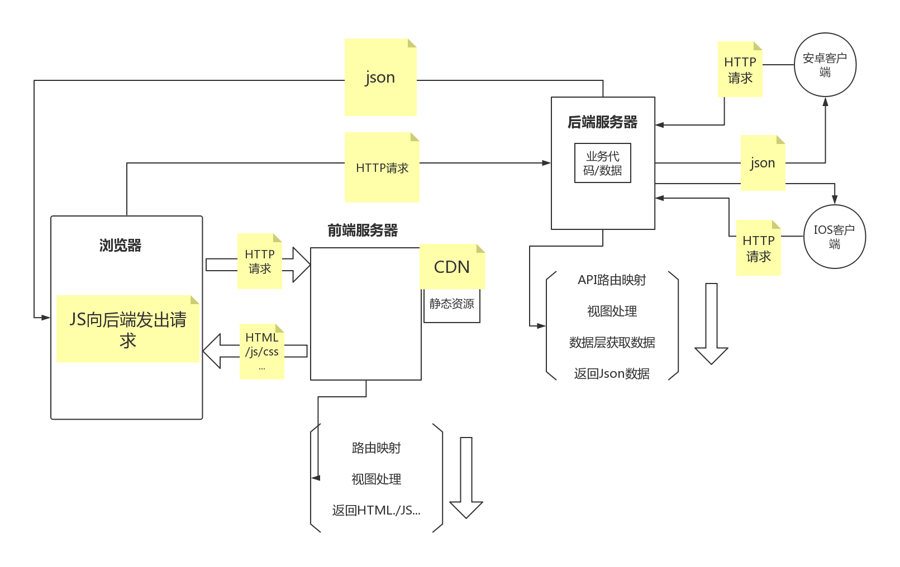

# blog_project
一个内部技术文档/内容 收录平台 ；wiki

## Mien博客

#### **前后端分离流程图**



**1.后端环境**

**Python3.6 + django2.2.12 + mysql8.0.26 + Ubuntu + vim+redis**

**2.通信协议**

**http**

**3.通信格式**

**json**

**API设计一定程度的遵循了RESTful设计风格**

**4状态码**

**返回结构如{ ' code ' ：200， ' data ' ：{}， ' error ' : ' xxx ' }**

开发模式：企业主流-前后端分离

主体功能：

	1）用户功能

	2）文章功能
	
	3）留言功能
	
	4）回复功能
	
	5）支付功能（v2）


**1、****创建Django项目为Mienblog**

`**django-admin startproject Mienblog**`

**2、进入mysql数据库-创建mysql数据库为Mienblog**

`create database Mienblog default charset utf8;`

**3、配置settings.py**

​	1）注释 MIDDLEWARE 中的  'django.middleware.csrf.CsrfViewMiddleware',

```python
2）DATABASES = {
'default': {
    'ENGINE': 'django.db.backends.mysql',
    'NAME': 'Mienblog',#数据库名字
    'USER':'root',#用户
    'PASSWORD':'17',#密码
    'HOST':'127.0.0.1',
    'PORT':'3306'#端口号
}
}
```

3）配置时区

```python
LANGUAGE_CODE = 'zh-Hans'

TIME_ZONE = 'Asia/Shanghai'
```

**4、配置cors**

1）、INSTALLED_APPS 中添加 corsheaders

2）、MIDDLEWARE 中添加 corsheaders.middleware.CorsMiddleware
		   位置尽量靠前，官方建议 ‘django.middleware.common.CommonMiddleware’ 上方

3）、CORS_ORIGIN_ALLOW_ALL  布尔值  如果为True 白名单不启用

​			正式环境应为false与4相结合使用

4）、白名单

```python
			CORS_ORIGIN_WHITELIST =[
			"https://example.com"
		]
```

5）、预检请求

```python
 CORS_ALLOW_METHODS = (
				'DELETE',
				'GET',
				'OPTIONS',
				'PATCH',
				'POST',
				'PUT',
				)
```

6)、遇见请求请求头

```python
 CORS_ALLOW_HEADERS = (
				'accept-encoding',
				'authorization',
				'content-type',
				'dnt',
				'origin',
				'user-agent',
				'x-csrftoken',
				'x-requested-with',
			)
```

7）、请求缓存时间

​		CORS_PREFLIGHT_MAX_AGE  默认 86400s

8）、特殊响应头

​		CORS_EXPOSE_HEADERS  []

9）、是否要跨域的cookie

​		CORS_ALLOW_CREDENTIALS  布尔值， 默认False

7/8/9不用配置

### 用户模块

#### **数据库结构：**

| 字段名       | 类型         | 作用     | 备注1                        | 备注2 |
| ------------ | ------------ | -------- | ---------------------------- | ----- |
| username     | varchar(11)  | 用户名   | 注册时填写的用户名，不可修改 | 主键  |
| nickname     | varchar(30)  | 昵称     | 在博客中显示的名字，可修改   | 无    |
| email        | varchar(50)  | 邮箱     | 预留                         | 无    |
| phone        | varchar(11)  | 手机号   | 无                           | 无    |
| password     | varchar(32)  | 密码     | 用户密码，已散列存储         | 无    |
| sign         | varchar(50)  | 个人签名 | 无                           | 无    |
| info         | varchar(150) | 个人描述 | 无                           | 无    |
| avatar       | varchar(100) | 头像     | 无                           | 无    |
| created_time | datetime     | 创建时间 | 无                           | 无    |
| updated_time | datetime     | 更新时间 | 无                           | 无    |
